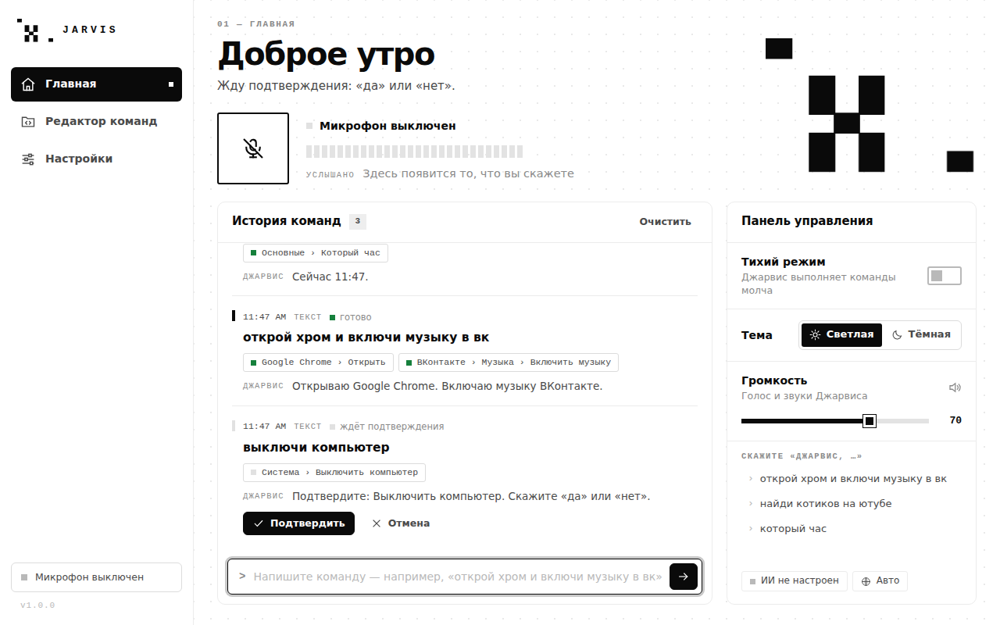
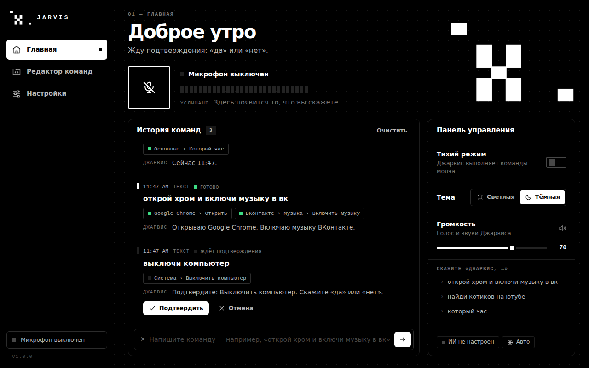
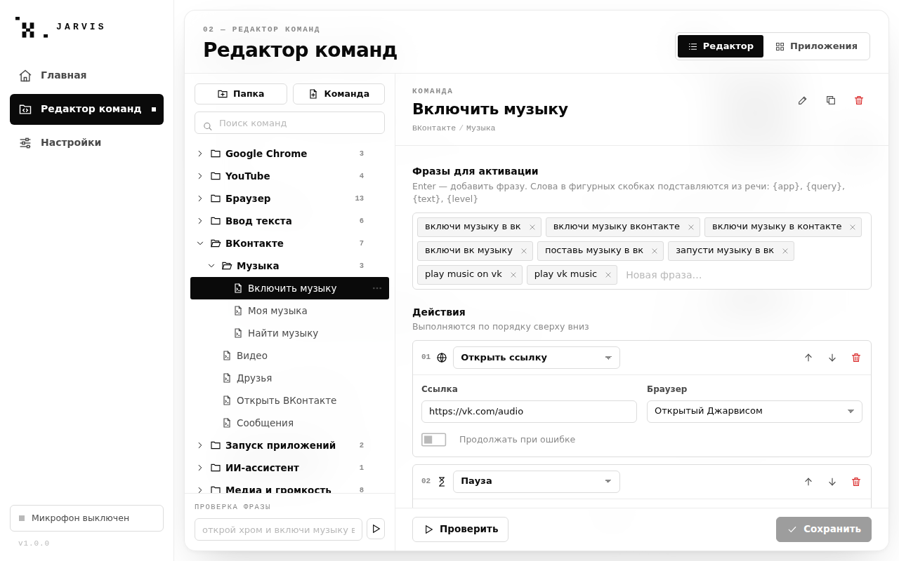

# Jarvis — голосовой ассистент для ПК

Говорите «**Джарвис, открой хром и включи музыку в вк**» — Джарвис откроет Chrome, зайдёт в музыку ВКонтакте, нажмёт «Перемешать/Слушать» и ответит голосом.



| Тёмная тема | Редактор команд |
|---|---|
|  |  |

## Что умеет

- **Голосовое управление с префиксом.** Джарвис слушает микрофон и реагирует только на фразы, которые начинаются с префикса («джарвис» по умолчанию; его можно поменять). Можно сказать просто «Джарвис» — прозвучит короткий сигнал, после чего говорите команду.
- **Связки команд.** «Открой хром **и** включи музыку в вк», «открой стим **затем** запусти доту». Слова-связки настраиваются. Понимает и сокращения: «открой хром и телеграм».
- **Подтверждение и отмена.** Опасные команды (выключить, перезагрузить компьютер, очистить корзину) Джарвис сначала переспросит: ответьте «да / правильно / подтверждаю» или «нет / отмена / отменить» (слова настраиваются). Кнопки подтверждения есть и в истории.
- **Главная**: микрофон с индикатором уровня, «услышанная» фраза, **история команд** (что вы сказали, какие команды выполнились и что ответил Джарвис), строка для ввода команды текстом и **панель управления**: тихий режим, тема, громкость.
- **Редактор команд**: команды хранятся как настоящие папки и файлы. **Одна папка — одно приложение**, внутри — подпапки и файлы-команды. В команде: фразы для активации, список действий и ответ Джарвиса. Внизу есть «Проверка фразы» — покажет, какая команда сработает.
- **Приложения**: каталог из ~140 программ и сервисов по категориям — Популярное; Соцсети и общение; Дизайн и творчество; Видео, музыка и стриминг; Работа и разработка; Игровые сервисы; Команды по умолчанию. Кнопка «Подключить» создаёт папку с готовыми командами. «Найти программы на ПК» показывает, что установлено.
- **ИИ** (по желанию): бесплатные модели OpenRouter, локальная Ollama, DeepSeek или любой OpenAI-совместимый сервис — отвечает на вопросы («джарвис, что такое чёрная дыра») и понимает команды, которых нет в редакторе.
- **Тема**: светлая и тёмная — лого становится белым, фон чёрным. При открытии вкладки фон размывается. Анимации можно отключить.
- **Голос Джарвиса**: нейросетевой (мужской голос Microsoft «Dmitry», для английского — «Ryan») или системный голос Windows. Тихий режим — Джарвис выполняет команды молча.

## Установка (Windows 10/11)

1. Установите **Python 3.12 или 3.13** с [python.org](https://www.python.org/downloads/). В установщике отметьте **Add python.exe to PATH**.
2. Скачайте эту папку `jarvis` (например, *Code → Download ZIP* на GitHub) и распакуйте.
3. Запустите **`install.bat`** — он создаст окружение `.venv` и поставит зависимости (нужен интернет, 1–3 минуты).
4. Запускайте **`start.bat`**.

Окно программы использует Microsoft Edge WebView2 — он уже есть в Windows 10/11. Если окно не открывается, запустите `start_browser.bat`: интерфейс откроется в браузере, а всё остальное будет работать так же.

### Собрать .exe

`build.bat` соберёт программу в `dist\Jarvis\Jarvis.exe` (папку `dist\Jarvis` можно переносить на другие компьютеры, Python там не нужен). Готовую сборку также делает GitHub Actions: вкладка *Actions → Jarvis — Windows build → Artifacts → Jarvis-windows*.

## Как пользоваться

1. Нажмите большую кнопку микрофона на главной (или включите «Автовключение микрофона» в настройках).
2. Скажите «Джарвис, …» и команду. Примеры:

| Фраза | Что произойдёт |
|---|---|
| Джарвис, открой хром и включи музыку в вк | Chrome → vk.com/audio → нажмёт «Перемешать/Слушать» |
| Джарвис, найди котиков на ютубе | поиск на YouTube |
| Джарвис, открой телеграм | запустит Telegram (любую программу из каталога или меню «Пуск») |
| Джарвис, закрой дискорд | закроет программу |
| Джарвис, пауза / следующий трек / громче / громкость 30 | управление музыкой и звуком |
| Джарвис, новая вкладка / закрой вкладку / обнови страницу | управление браузером |
| Джарвис, сверни все окна / сделай скриншот / заблокируй компьютер | система |
| Джарвис, напиши Привет всем | напечатает текст в активном окне |
| Джарвис, который час / какое сегодня число | ответит голосом |
| Джарвис, выключи компьютер → «да» | выключение с подтверждением |
| Джарвис, тихий режим / тёмная тема | управление самим Джарвисом |

Команды можно писать и в строке под историей — префикс там не нужен.

## Редактор команд

Команды лежат в `%APPDATA%\Jarvis\commands` — это обычные папки и JSON-файлы, их можно копировать и передавать друзьям.

```
commands\
  Google Chrome\            ← папка = приложение (настройки папки в _folder.json)
    Открыть.json
    Закрыть.json
  ВКонтакте\
    Музыка\                 ← подпапки группируют действия
      Включить музыку.json
```

**Фразы для активации** — как вы произносите команду. Слова в фигурных скобках подставляются из речи:
`открой {app}`, `найди {query} на ютубе`, `напиши {text}`, `громкость {level}`. Джарвис понимает падежи и неточности распознавания («открой хрома», «включи музыку вк»).

**Действия** выполняются по порядку:

| Действие | Пример |
|---|---|
| Открыть / закрыть приложение, перейти в окно | `chrome`, `{app}`, пусто = приложение папки |
| Открыть ссылку | `https://vk.com/audio` в браузере, открытом Джарвисом |
| Поиск в интернете | Google, Яндекс, YouTube, Bing, DuckDuckGo, VK |
| Нажать клавиши | `ctrl+t`, `alt+f4`, `win+d` (кнопка «Записать» запишет сочетание) |
| Нажать кнопку на экране | найдёт кнопку с текстом («Перемешать», «Play») в активном окне, в том числе на сайте |
| Медиаклавиша, громкость системы | пауза, следующий трек, громкость 0–100 |
| Напечатать текст, пауза, сказать фразу | `{text}`, `1.5` сек, `Сейчас {time}` |
| Системное действие | блокировка, сон, выключение, перезагрузка, скриншот, корзина |
| Спросить ИИ, выполнить другую команду, команда Windows | |

**Ответ Джарвиса** может содержать переменные `{time}`, `{date}`, `{weekday}`, `{app_name}`, `{query}`, `{level}`.

Если Джарвис не нашёл программу сам, откройте её папку и укажите **путь к .exe** (кнопка «Обзор…»).

## ИИ-провайдер

ИИ отвечает на вопросы («джарвис, что такое чёрная дыра») и выполняет команды, которых нет в редакторе. Выберите провайдера в *Настройки → ИИ-провайдер* и нажмите «Проверить» — Джарвис отправит короткий запрос и покажет, что всё работает, или объяснит, что не так.

| Провайдер | Цена | Что нужно |
|---|---|---|
| **OpenRouter** (по умолчанию) | бесплатно: до 50 запросов в сутки и 20 в минуту (1000 в сутки после разового пополнения на $10) | аккаунт на [openrouter.ai](https://openrouter.ai) и ключ: *Keys → Create key* |
| **Ollama** | бесплатно, без лимитов и интернета | [Ollama](https://ollama.com/download) и модель: `ollama pull qwen2.5:7b` (около 5 ГБ, от 8 ГБ оперативной памяти) |
| **DeepSeek** | платно, с баланса | пополненный баланс и ключ на [platform.deepseek.com](https://platform.deepseek.com) |
| **Другой** | зависит от сервиса | адрес OpenAI-совместимого API (Groq, Google Gemini, LM Studio…), ключ и модель |

> **Почему DeepSeek пишет, что закончились токены, хотя ключом не пользовались?** Бесплатный у DeepSeek только чат на сайте chat.deepseek.com, а API платный: каждый запрос оплачивается с баланса. У нового ключа баланс нулевой, поэтому сервер отвечает «Insufficient Balance» (HTTP 402). Пополните баланс на platform.deepseek.com или выберите OpenRouter / Ollama — кнопка «Проверить» теперь показывает баланс DeepSeek.

**Модель** выбирается автоматически: у OpenRouter — лучшая бесплатная (DeepSeek, Llama, Qwen…), а если она перегружена, OpenRouter сам возьмёт следующую; у Ollama — подходящая из скачанных; у DeepSeek — самая новая быстрая. Её можно выбрать и вручную.

Если OpenRouter пишет, что бесплатные модели запрещены настройками приватности, включите *Enable free endpoints that may publish prompts* на странице [openrouter.ai/settings/privacy](https://openrouter.ai/settings/privacy). Бесплатные модели могут сохранять запросы — не диктуйте Джарвису пароли и личные данные (Ollama работает полностью на компьютере).

Ключи хранятся зашифрованными (Windows DPAPI) и отправляются только выбранному провайдеру. ИИ не может выключать компьютер и запускать команды Windows — только безопасные действия.

## Настройки

- **Звук**: громкость программы 1–100, голос (нейросетевой / системный), проверка голоса.
- **Интерфейс**: язык (русский / английский), тема, анимации.
- **Голосовой ввод**: язык распознавания (авто / русский / английский), префикс, автовключение микрофона, выбор микрофона.
- **Выполнение команд**: слова подтверждения, отмены и связки — редактируются.
- **ИИ-провайдер**: OpenRouter, Ollama, DeepSeek или другой сервис; ключ или адрес, модель, проверка.

## Важно знать

- Распознавание речи — **Google Web Speech**, нейросетевой голос — **Microsoft Edge TTS**: оба требуют интернет. Без интернета Джарвис говорит системным голосом Windows, а команды можно вводить текстом.
- В Google отправляются только отрезки речи, которые услышал микрофон (пока он включён), — выключайте микрофон, если не пользуетесь.
- «Включи музыку в вк» нажимает кнопку «Перемешать / Слушать / Воспроизвести» на странице vk.com/audio. Если ВКонтакте поменяет надписи, исправьте текст кнопки в команде *ВКонтакте → Музыка → Включить музыку*. Браузер должен быть уже авторизован во ВКонтакте.
- Данные: `%APPDATA%\Jarvis` — `commands\`, `settings.json`, `history.json`, журнал `jarvis.log`.

## Решение проблем

| Проблема | Что сделать |
|---|---|
| Окно не открывается | `start_browser.bat`; установите [WebView2 Runtime](https://developer.microsoft.com/microsoft-edge/webview2/) |
| Микрофон не включается | Настройки → Голосовой ввод → Микрофон; разрешите доступ к микрофону в параметрах Windows |
| Джарвис не реагирует | Говорите префикс в начале фразы; проверьте строку «Услышано» на главной и интернет |
| Говорит роботом | Нейросетевой голос недоступен (нет интернета) — включился системный |
| Команда не та | «Проверка фразы» в редакторе покажет, что срабатывает; добавьте фразы в нужную команду |
| DeepSeek: «нет денег на балансе», «закончились токены» | API DeepSeek платный — пополните баланс или выберите бесплатный OpenRouter / Ollama ([подробнее](#ии-провайдер)) |
| ИИ не отвечает | Настройки → ИИ-провайдер → «Проверить»: покажет причину и что сделать |

## Для разработчиков

```
main.py              запуск (--browser — интерфейс в браузере, --debug — инструменты разработчика)
jarvis/
  assistant.py       префикс, связки, подтверждение, история, ответы
  matcher.py         нечёткое сопоставление фраз (RU/EN), {подстановки}
  store.py           команды как папки и файлы
  catalog.py         каталог приложений и готовые наборы команд
  actions.py         выполнение действий
  apps.py, winapi.py поиск/запуск программ, клавиатура, окна, UI Automation, DPAPI
  voice/             микрофон и детектор речи, распознавание, голос
  ai.py              ИИ-провайдеры: OpenRouter, Ollama, DeepSeek, OpenAI-совместимые
  api.py, bridge.py  API для интерфейса (pywebview / HTTP)
web/                 интерфейс (HTML, CSS, JS без сборки)
tests/               pytest
```

Тесты: `pip install -r requirements-dev.txt` и `python -m pytest`. Проверка интеграции с Windows: `python scripts/smoke_windows.py` (DPAPI, поиск программ, голоса, UI Automation) и `python scripts/smoke_windows_actions.py` (печать в Блокнот, нажатие кнопки на странице в Chrome и цепочка «открой хром → открой страницу → нажми кнопку» — откроет и закроет Блокнот и Chrome). Всё это автоматически выполняется в GitHub Actions на Windows вместе со сборкой `Jarvis.exe`.
